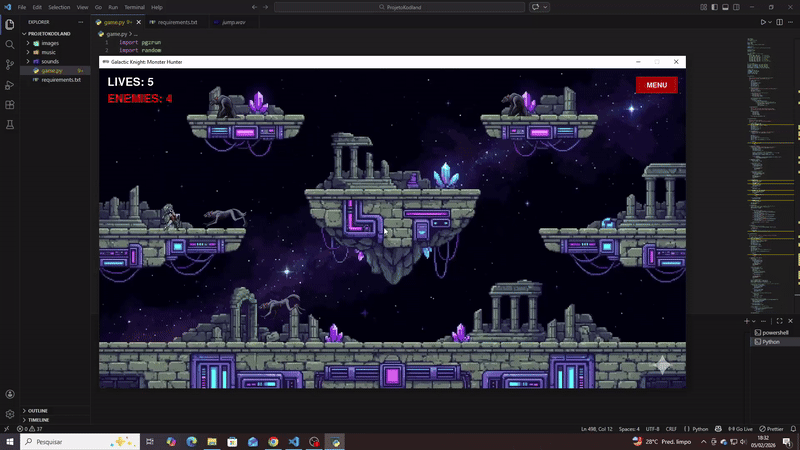

# 🛡️ Galactic Knight: Monster Hunter

> Um jogo de plataforma 2D ágil desenvolvido puramente em Python usando a biblioteca PgZero.

### 📺 [Clique aqui para assistir ao Gameplay Completo no YouTube](https://youtu.be/j719nAc45Ow)

---

## 💻 Sobre o Projeto
Este projeto foi desenvolvido como tarefa final para demonstrar a implementação de lógica avançada em Python sem depender de engines de jogos complexas (como Unity ou Godot).

Em vez de usar ferramentas "caixa-preta", cada mecânica foi codificada do zero usando **Lógica de Programação Pura**:
* **Motor de Física:** Implementação personalizada de gravidade, velocidade e detecção de solo.
* **Sistema de Colisão:** Detecção precisa de *hitbox* usando geometria matemática (Rects) para lidar com aterrissagens em plataformas e interação de combate.
* **Gerenciamento de Assets:** Controle manual de folhas de sprites (sprite sheets) e quadros de animação.

## 🧠 Lógica dos Inimigos (Máquina de Estados)
Os inimigos não utilizam bibliotecas de "IA" padrão. O comportamento deles é governado por uma **Máquina de Estados Finitos (FSM - Finite State Machine)** programada manualmente:

1.  **Estado de Patrulha/Ocioso:** O inimigo espera ou se move dentro de uma zona designada.
2.  **Heurística de Detecção:** Usando matemática de coordenadas (`abs(x1 - x2)`), o inimigo calcula a distância até o jogador em tempo real.
3.  **Estado de Perseguição ("Parkour"):**
    * Se o jogador estiver em uma plataforma mais alta, a lógica aciona um cálculo de pulo quando o inimigo toca o chão.
    * Isso cria um comportamento de perseguição dinâmico onde os inimigos podem escalar o cenário para alcançar o alvo.
4.  **Estado de Combate:** Quando está ao alcance, o inimigo muda para o modo de ataque.
5.  **Lógica de Sniper:** Inimigos específicos possuem um temporizador de atraso/emboscada programado, aguardando o jogador se aproximar antes de ativar.

## 🕹️ Controles

| Tecla | Ação |
| :--- | :--- |
| **Setas (Esq/Dir)** | Mover Personagem |
| **Seta (Cima)** | Pular |
| **Espaço** | Atacar |
| **Mouse** | Interagir com o Menu |

## 🛠️ Tecnologias Utilizadas
* **Linguagem:** Python 3.13
* **Biblioteca:** Pygame Zero (PgZero)
* **Módulos:** `math`, `random`
* **Conceitos:** POO (Programação Orientada a Objetos), Herança, Máquinas de Estados.

---
Desenvolvido por [Mateus Felix].
